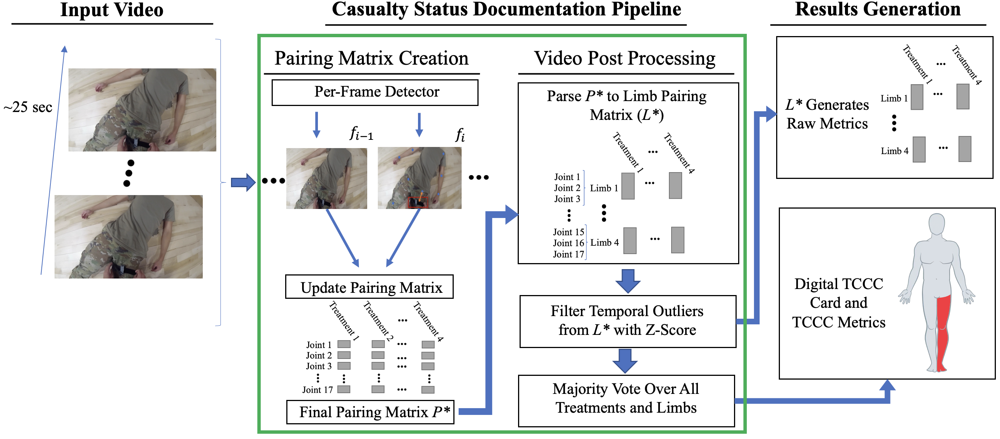
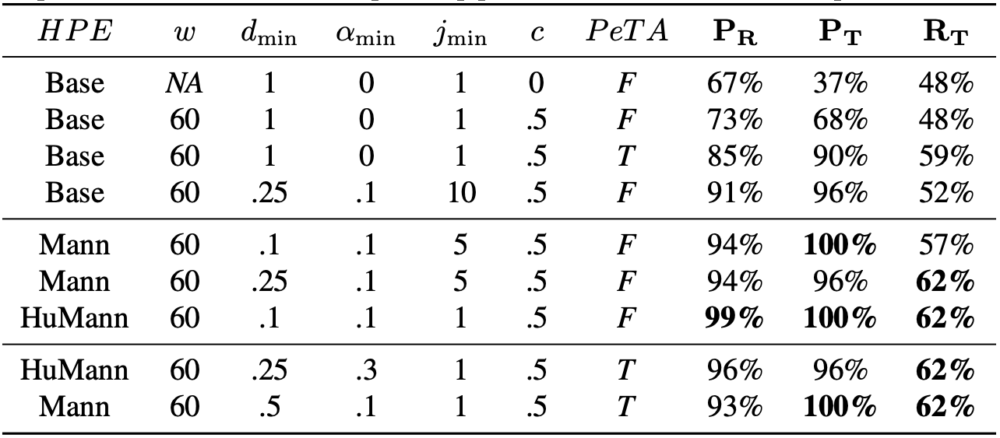
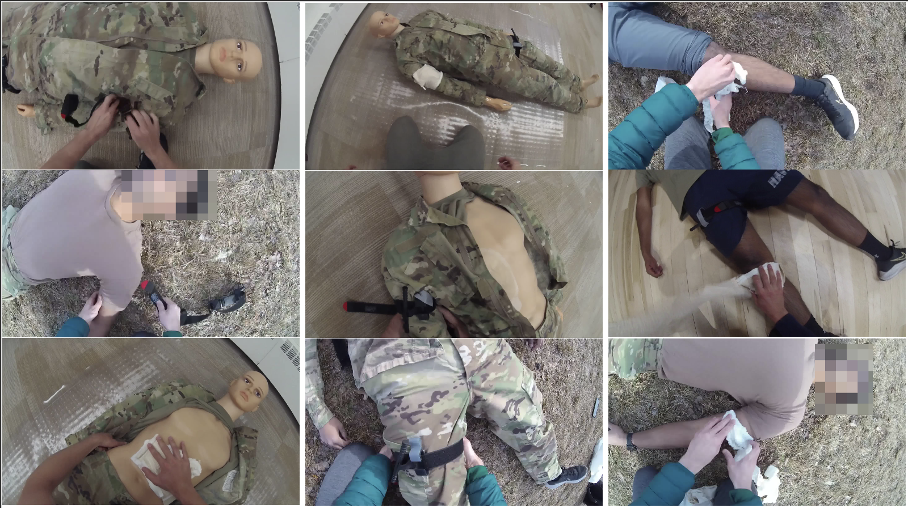

# Vision-Based Treatment Localization with Limited Data: Automated Documentation of Military Emergency Medical Procedures
*Authors: Trevor Powers, Elaheh Hatamimajoumerd, William Chu, Marc Vaillant,
Rishi Shah, Vishakk Rajendran, Frank Diabour, Richard Fletcher, Sarah Ostadabbas* 

<p align="center">
  <a href="#Introduction">Introduction</a> |
  <a href="#Framework">Framework</a> |
  <a href="#Main Results">Main Results</a> |
  <a href="#Experiment">Experiment</a> |
  <a href="#Acknowledgments">Acknowledgments</a> 
</p>

## Introduction
<p align="center">

</p>
This repository is the official repository of <a href=''>Vision-Based Treatment Localization with Limited Data: Automated Documentation of Military Emergency Medical Procedures</a>. 
In response to the challenges faced in documenting medical procedures in military settings, where time constraints and cognitive load limit the completion of life-saving Tactical Combat Casualty Care (TCCC) Cards, we present a novel end-to-end computer vision pipeline for autonomous detection and documentation of common military emergency medical treatments. Our pipeline is specifically designed to handle limited and challenging data encountered in military scenarios. To support the development of this pipeline, we introduce SimTrI, a labeled dataset comprising 116 twenty-second videos capturing patients undergoing four prevalent treatment procedures. Our pipeline incorporates training and fine-tuning of object detection and human pose estimation models, complemented by a proprietary pose-enhancement algorithm and a range of unique filtering and post-processing techniques. Through comprehensive development and optimization, our pipeline achieves exceptional performance, demonstrating 100% precision and 62% recall on our dedicated 23-video test set. Furthermore, the pipeline automates the generation of TCCC-relevant information, significantly improving the efficiency of TCCC documentation.

## Framework


Illustration of our comprehensive pipeline for casualty status documentation. The pipeline consists of two main stages, shown from left to right. In the first stage (Pairing Matrix Creation), the input video is processed frame by frame, and relevant detections are analyzed and summarized to generate a pairing matrix. In the second stage (Video Post Processing), the summarized detections undergo post-processing to extract TCCC-relevant information. Subsequently, in the Results Generation stage, the pipeline generates a digital TCCC card formatted with the extracted information, and its metrics are reported based on the ground truth data.

## Main Results


## SimTrI Dataset
The public version of our dataset, named Simulated Trauma Interventions (SimTrI), consists of 30 egocentric videos featuring simulated casualties represented by a mannequin. You can download it [here](https://coe.northeastern.edu/Research/AClab/Mansts). The videos capture the performance of four standard military trauma care interventions: tourniquet application, pressure dressing, hemostatic dressing, and chest seal placement. These interventions were selected because they allow for a range of anatomical placement options, necessitating the incorporation of a localization component into our research pipeline. Furthermore, these treatments are commonly taught to all military personnel as part of Combat Life Saver (CLS) training \cite{cls}. It is essential to emphasize that the individuals responsible for video documentation in SimTrI are CLS certified military personnel, ensuring the accuracy and adherence to established medical protocols. The videos were recorded using a helmet-mounted camera positioned approximately three inches above the forehead. The camera was set to record at a rate of 30 frames per second and aligned with the user's line of sight. Example screenshots from this dataset are shown above. Faces are blurred to protect privacy in accordance with our International Review Board approval.


## Setting Up the Environment

To run this project, follow these steps to set up the environment and install the required packages:

```
git clone https://trevorpowers99@bitbucket.org/aclabneu/automated-documentation-of-military-emergency-medical.git

cd automated-documentation-of-military-emergency-medical

conda create -n myenv python=3.10

conda activate myenv

pip install -r requirements.txt
```

## Recreating Our Results

Running the following commands allows you to recreate our results:

```
conda activate myenv

cd automated-documentation-of-military-emergency-medical/pipeline

python demo.py

```

## Citation

If you use our code, datasets or models in your research, please cite with:

```
@article{???,
  title={Vision-Based Treatment Localization with Limited Data: Automated Documentation of Military Emergency Medical Procedures},
  author={Powers, Trevor and Hatamimajoumerd, Elaheh and Chu, William and Rajendran, Vishakk and Shah, Rishi and Diabour, Frank and Vaillant1, Marc and Fletcher, Richard and Ostadabbas, Sarah},
  year={2023}
}
```
## Acknowledgement

## License 
* This code is for non-commertial purpose only. 
* For further inquiry please contact: Augmented Cognition Lab at Northeastern University: http://www.northeastern.edu/ostadabbas/ 
